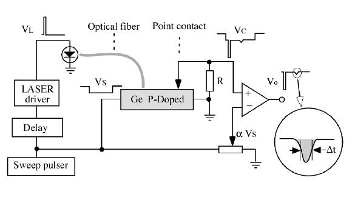

# Haynes-Shockley experiment
> The Charge mobility in semiconductor materials
## goals
- Minority charge carriers amount.
- The effect of the distance between electrodes on the specimen in the production of electrons and holes.
- Measuring of carrier’s lifetime.

***Photo electric effect (laser beam) causes the drift mobility of minority charge carriers sweeps length of the semiconductor.***

Important fields: ***lifetime, drift velocity, electric field***

<h2>Measurement of drift velocity</h2>

Es is an internal electric pulse field that produced by a pulsed generator. Distance between optical fiber and needle (<ins>point contact</ins>) is d. Vs is the electrical pulls and Vl is the laser pulls. The laser pulls causes 2 small peak between up and down main semiconductor peak. The
second peak is the wider and relevant to minority carriers. 

<!DOCTYPE html>
<html>
<head>
</head>
<body>

<h1>Functions Table</h1>

<table>
  <tr>
    <td>is the drift velocity</td>
    <td></td>
  </tr>
  <tr>
    <td>sweep field (L : sample length)</td>
    <td></td>
  </tr>
  <tr>
    <td>So electron mobility is </td>
    <td></td>
  </tr>
  <tr>
    <td>So relation of Diffusion and collected pulse </td>
    <td></td>
  </tr>
</table>

</body>
</html>

  The semiconductor sample is a thin bar (approximately 3x3x30 mm) of single crystal ingot.

<h3>Measurement of the time of flight t</h3>

  Due to the constant of the distance and the moving fields, the flight time is also constant, which
does not depend on the density of the laser pulse. So light pulse just increases peak of graph
relevant to the voltage. Despite the fact that t is grown by increasing inject charge density.
  

